# CRM 功能与操作手册

最后更新：2026-09-20

> 这是一份面向销售和主管的新手手册。阅读顺序是：认识 CRM → 页面导航 → 登录 CRM → 按左侧菜单顺序了解功能。技术部署、数据库、邮箱连接和发布流程不属于日常使用内容，本手册不展开。

## 一、认识 CRM

CRM 用来集中处理客户资料、线索、项目和沟通记录。日常工作主要围绕四件事：

1. 接收和回复官网、WhatsApp 等渠道的客户消息；
2. 把访客或邮件整理成线索，补充客户资料并分配负责人；
3. 维护客户和项目的长期跟进记录；
4. 从邮件、聊天和沟通状态中回看完整的沟通历史。

访问地址：`https://crm.chinanhd.com`

## 二、页面导航

左侧菜单是日常工作的入口：

| 板块 | 用途 |
|---|---|
| 对话工作台 | 处理官网访客和 WhatsApp 即时消息 |
| 邮箱 | 查看收件、发件、重点、客户和垃圾邮件 |
| 线索 | 管理尚未完全转化的潜在客户 |
| 客户 | 管理已经确认的公司和联系人 |
| 项目 | 跟踪具体项目或订单的推进情况 |
| 沟通状态 | 按记录查看和复核历史沟通 |
| 设置 | 维护个人资料、个人渠道和使用偏好 |

### 建议的截图放置方式

每个板块只放一张“入口 + 关键操作”的截图，截图下方配三行说明：**在哪里、能做什么、下一步是什么**。截图统一放在 `docs/assets/crm-user-guide/`，文件名使用板块名，避免把整套桌面截图直接堆进文档。

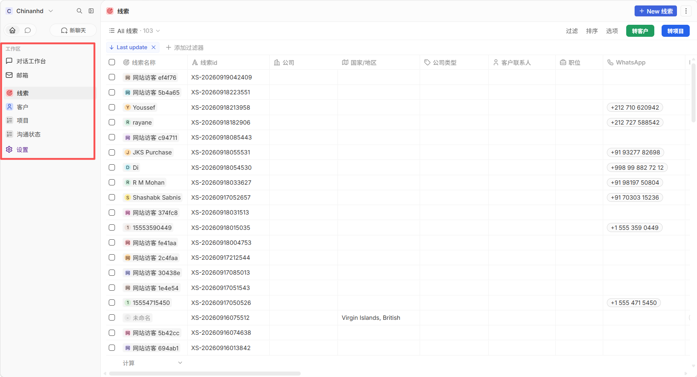

图：左侧菜单和线索列表入口。

## 三、登录 CRM

### 登录步骤

1. 管理员先向你的企业邮箱发送 CRM 邀请邮件。
2. 打开邀请邮件，点击邮件中的邀请链接。
3. 按页面提示设置登录密码，完成账号激活。
4. 使用受邀邮箱和新设置的密码登录 `https://crm.chinanhd.com`。
5. 登录后确认左侧菜单正常显示，再开始使用。
6. 如果提示登录状态失效，刷新页面并重新登录；不要在失效页面重复提交数据。

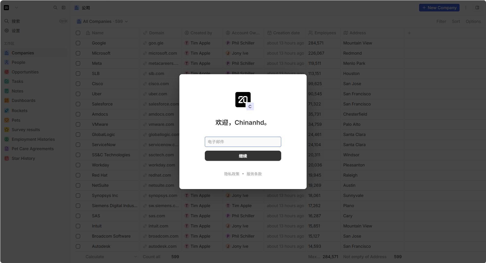

图：邀请链接打开后进入登录/激活页面；首次使用需要先设置密码。

## 四、对话工作台

### 这是做什么的

对话工作台用于处理即时消息。顶部按渠道筛选，左侧是会话清单，中间是消息区，右侧是客户资料和线索表单。

当前主要使用的渠道：

- **官网**：官网客服 Widget 收到的访客消息；
- **WhatsApp**：销售自己绑定的 WhatsApp 账号；
- 其他渠道入口可能保留在界面中，是否可用以当前配置为准。

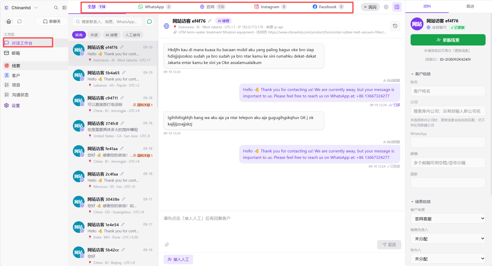

图：左侧会话、中间消息区、右侧资料面板和顶部渠道筛选。

### 可以做什么

1. 在左侧选择会话，查看客户消息和时间。
2. 查看官网访客的地区、时区、访问页面和来源信息。
3. 发送文字、图片或文件。
4. 在 AI 接管和人工接待之间切换。
5. 在右侧表单填写姓名、公司、邮箱、WhatsApp 等资料。
6. 将访客转为线索，或更新已有线索。
7. 查看疑似关联访客，判断是否为同一客户重复访问。

### 右侧客户资料表单

右侧表单用于补充客户信息和转为线索。系统会根据当前会话渠道自动填写“客户来源”：WhatsApp 会填写 WhatsApp，官网会填写官网，其他已接入渠道同理。销售只需要继续补充姓名、公司、邮箱、WhatsApp 等字段，并在保存前检查重复提示。

### 会话列表

- 首次只加载部分会话，向下滚动会继续加载。
- 顶部渠道数量是当前账号可见的汇总，不等于当前已经加载到屏幕上的条数。
- 今天通常显示时间，较早记录显示日期，跨年记录显示完整日期。

### AI 接管与人工接待

AI 配置可以按渠道分别设置：是否启用、全天或按时段生效，以及人工接待未回复多久后由 AI 代答，范围为 1–120 分钟。

- **短时未回复**：超过设置时间后，AI 回复当前客户消息，但保留人工接待状态；
- **长期无人回复**：人工连续较长时间没有销售消息，系统会释放会话并恢复 AI 接管，同时将销售状态切换为离线。当前规则为 120 分钟。
- 从 AI 接管切换为人工接待前，销售必须先切换为在线；离线状态不能直接接管，系统会先提示上线。

修改配置后点击“保存”，页面会在当前窗口显示保存成功提示。

### 官网消息通知

- 没有负责人和协办人：通知配置范围内的销售；
- 已填写负责人或协办人：只通知对应人员；
- 已接管为人工会话：优先通知当前负责人；
- WhatsApp 等非官网渠道不走这条官网客服通知规则。

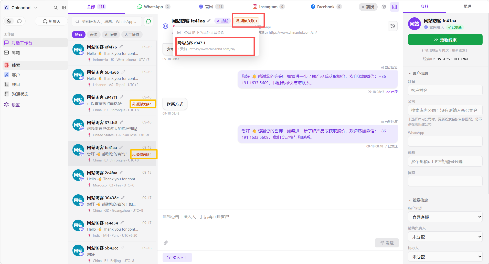

图：官网会话中显示疑似关联访客数量，并可查看关联会话。

### 对话工作台操作说明

#### 绑定 WhatsApp 渠道

适用场景：销售需要在 CRM 中接收和发送自己 WhatsApp 账号的消息。

1. 点击左侧 **设置**。
2. 进入 **个人资料 → 渠道**。
3. 在 WhatsApp 区域点击“生成配对码”或“启动/刷新二维码”。
4. 在手机 WhatsApp 中打开 **已关联的设备**，选择添加设备并扫描二维码。
5. 回到 CRM 点击“刷新状态”，确认状态变为已连接或工作中。
6. 打开对话工作台，确认 WhatsApp 渠道和自己的会话可以正常显示。

成功标准：渠道状态正常，能看到自己的 WhatsApp 会话；先发送一条短文本测试，再发送附件。

注意：每个销售只绑定自己的 WhatsApp 账号。手机端退出关联设备、长时间未使用或账号掉线，都会影响 CRM 收发消息。

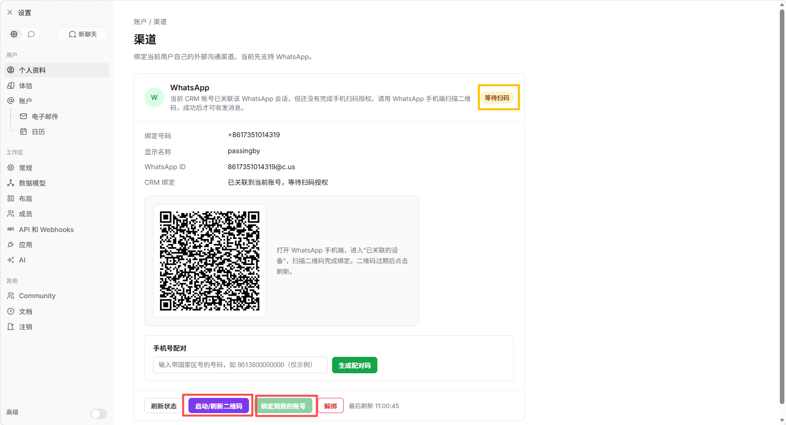

图：二维码、配对按钮、绑定状态和刷新状态入口。

#### 配置 AI 自动回复时间

适用场景：设置某个渠道是否允许 AI 自动回复，以及人工接待后多久由 AI 临时代答。

1. 打开 **对话工作台**。
2. 点击页面顶部的 **AI 自动回复配置**按钮。
3. 找到需要配置的渠道，例如“官网”。
4. 打开或关闭该渠道的 AI 开关。
5. 选择 **全天**，或选择 **按时段**。
6. 如果选择按时段，在下方填写开始时间和结束时间。
7. 在右侧“人工接待未回复时长”中填写 1–120 分钟。
8. 点击 **保存**，确认页面出现“配置已保存”。

配置含义：

- **全天**：该渠道全天允许 AI 按规则回复；
- **按时段**：只在设定时间内允许 AI 回复，跨过午夜的时间段也按系统提示处理；
- **人工接待未回复时长**：销售接管会话后，如果客户发来消息而销售在设定时间内没有回复，AI 可以代答该条消息，但暂时保留人工接待状态；
- 销售连续 120 分钟没有人工发送消息时，会话会自动释放给 AI，并将销售状态切换为离线。

建议先使用 1–5 分钟进行测试，确认规则符合预期后再调整正式时长。

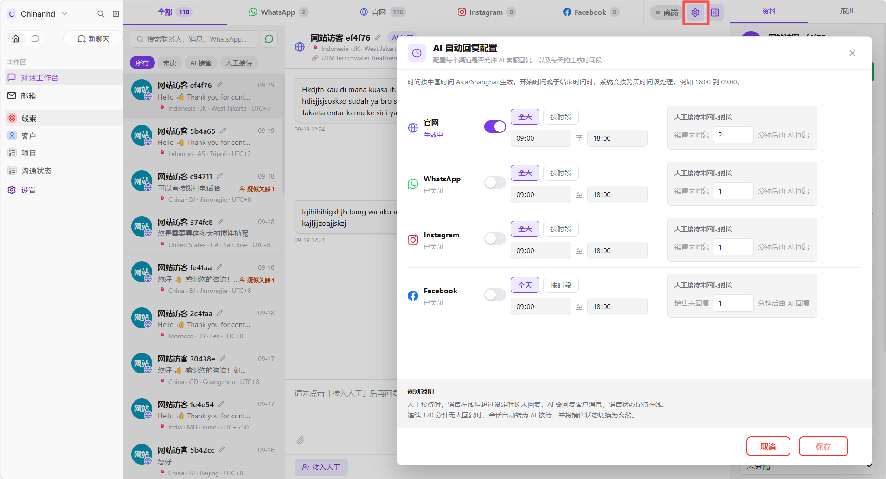

图：渠道开关、全天/按时段、时间输入和人工未回复时长。

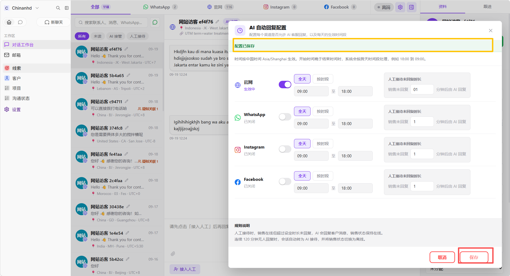

图：保存后页面显示“配置已保存”。

#### 人工接管官网会话

1. 在对话工作台顶部选择 **官网**。
2. 点击左侧需要处理的访客会话。
3. 先阅读最近消息和右侧访客信息。
4. 点击 **人工接待**或 **接管会话**。
5. 确认会话状态变为人工接待后，再发送消息。
6. 需要补充资料时，在右侧填写客户姓名、公司、邮箱、WhatsApp 等字段。

如果当前销售处于离线状态，切换为人工接待前需要先切换为在线；系统会弹窗提示，用户可以选择上线或保持 AI 接管。

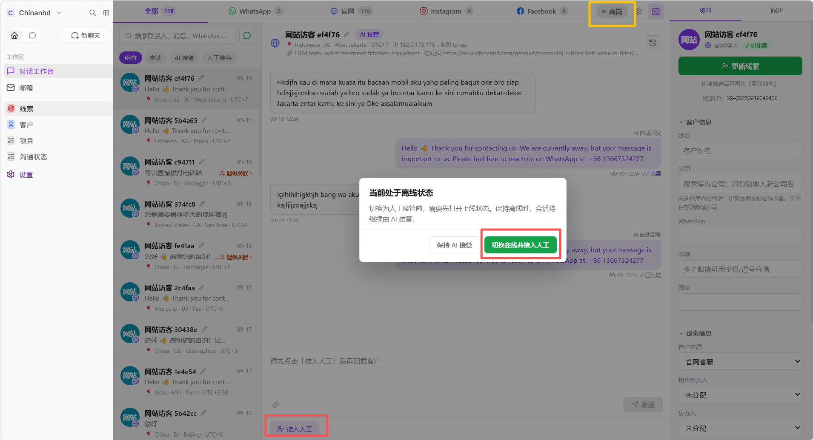

图：离线时选择切换在线并人工接入，或保持 AI 接管。

#### 将官网访客转为线索

1. 打开官网访客会话。
2. 在右侧资料面板填写客户姓名、公司、邮箱、WhatsApp、国家和客户需求。
3. 检查是否存在重复线索提示。
4. 点击 **转为线索**或 **更新线索**。
5. 选择销售负责人和协办人。
6. 确认保存成功后，到 **线索**板块检查记录是否已建立。

如果 WhatsApp、手机号、邮箱或官网链接与已有线索相同，系统会提示疑似重复。不要为了消除提示而随意修改客户联系方式。

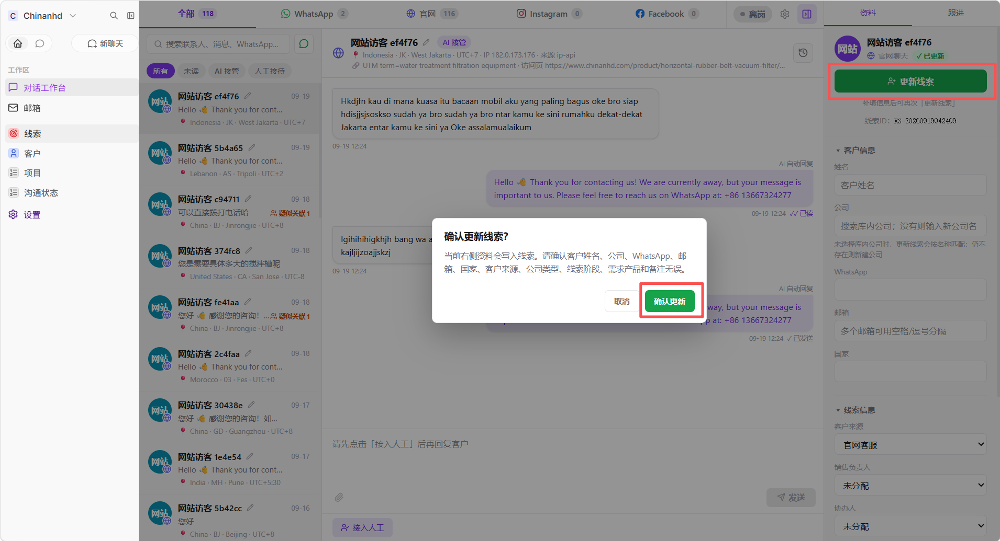

图：将右侧资料更新为线索前的确认提示。

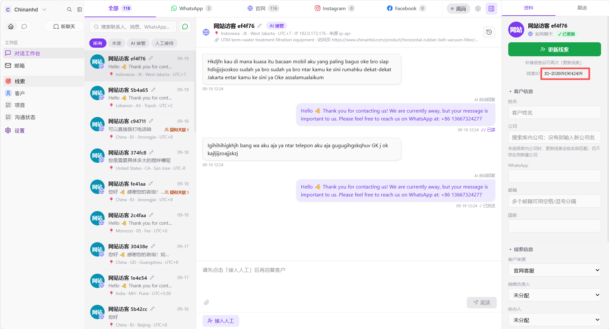

图：更新成功后，右侧资料面板显示线索编号。

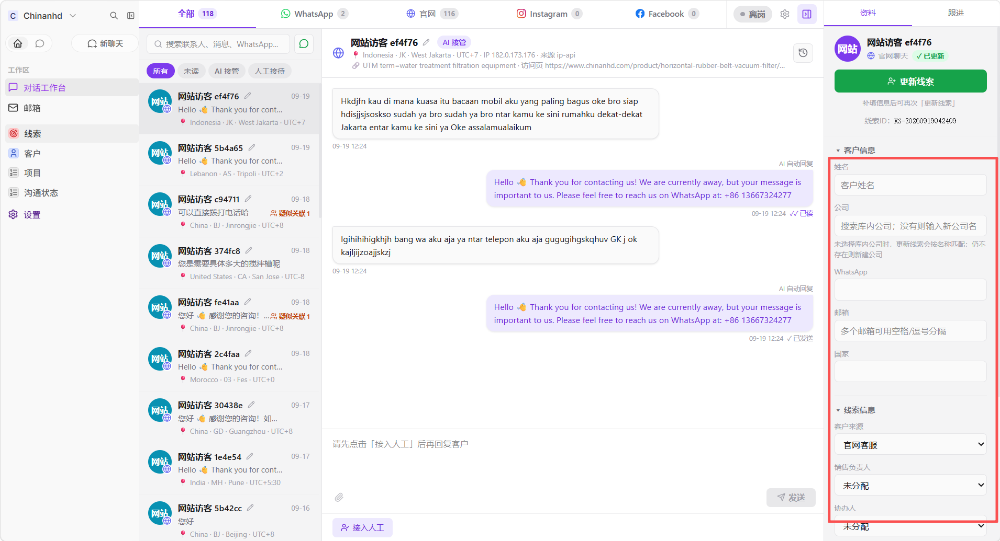

图：在右侧资料表单中补充客户姓名、公司、联系方式和来源。

#### 给线索分配负责人和协办人

1. 打开 **线索**板块并找到目标记录。
2. 修改 **销售负责人**。
3. 如需协作，再修改 **协办人**。
4. 点击空白处或离开字段，等待自动保存完成。
5. 刷新页面确认负责人和协办人仍然显示正确。

分配完成后，负责人和协办人可以看到对应记录；未分配的线索对销售开放范围更大。分配错误会直接影响数据可见范围和官网钉钉提醒对象。当前已实现：负责人本人或管理员可以设置协办人；负责人字段是否只允许主管填写，需要以当前角色权限测试结果为准。

#### 在邮箱中区分并整理邮件

1. 打开左侧 **邮箱**。
2. 使用“收件箱”或“发件箱”快速判断邮件方向。
3. 打开邮件详情，确认发件人、收件人、抄送人和引用历史。
4. 需要重点跟进时，在邮件列表中点击红旗/重点标识。
5. 点击邮件更多操作，可以设置为客户邮件或垃圾邮件。
6. 使用顶部分类查看重点、客户或垃圾邮件。

邮件正文中的引用历史与本次回复分开显示。白色或中性色区域通常是历史引用，不代表本次发送方；绿色背景表示当前收件邮件，蓝色背景表示当前发件邮件。颜色只是辅助提示，最终以邮件头部的“收件/发件”、发件人、收件人和时间为准。

#### 从邮件抄送人选择客户姓名

适用场景：一封邮件抄送多人，需要从邮件参与人中选择客户。

1. 打开目标邮件。
2. 在右侧资料表单点击 **客户姓名**。
3. 从下拉候选中选择合适的姓名。
4. 如需确认邮箱，查看邮件详情中的收件人和抄送人。
5. 补充公司、国家或 WhatsApp 后，点击空白处保存。

候选来源是邮件参与人，列表默认只显示姓名，不抓取正文中的引号内容。

#### 查看历史沟通

1. 打开 **沟通状态**。
2. 使用负责人、协办人或其他字段筛选记录。
3. 点击目标记录查看详细沟通内容。
4. 使用关键词查找具体消息。
5. 需要发送新消息时，回到 **对话工作台**，不要在沟通状态中操作。

## 五、邮箱

### 这是做什么的

邮箱板块用于查看已同步到 CRM 的企业邮箱记录。常用分类是：

- **收件箱**：收到的邮件；
- **发件箱**：本方发出的邮件；
- **重点邮件**：标记为重点的邮件；
- **客户邮件**：归类为客户往来的邮件；
- **垃圾邮件**：归类为垃圾邮件的邮件；
- **全部**：查看当前账号有权限看到的全部邮件。

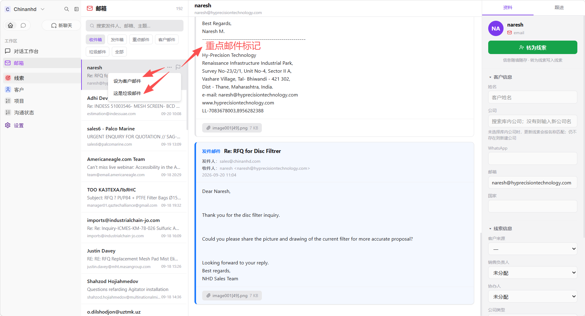

图：邮件列表中的重点标识和更多操作菜单。

### 如何区分收信和发信

先使用收件箱或发件箱分类，再打开邮件详情确认发件人、收件人、抄送人和时间。邮件正文中的引用历史会与本次内容分开显示，便于判断哪一段是对方原邮件、哪一段是本方回复。

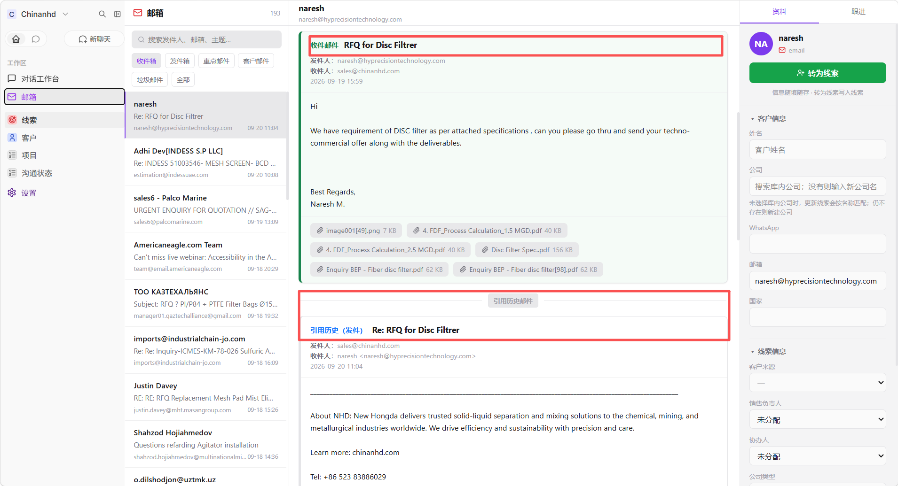

图：收件邮件的方向、正文和附件。

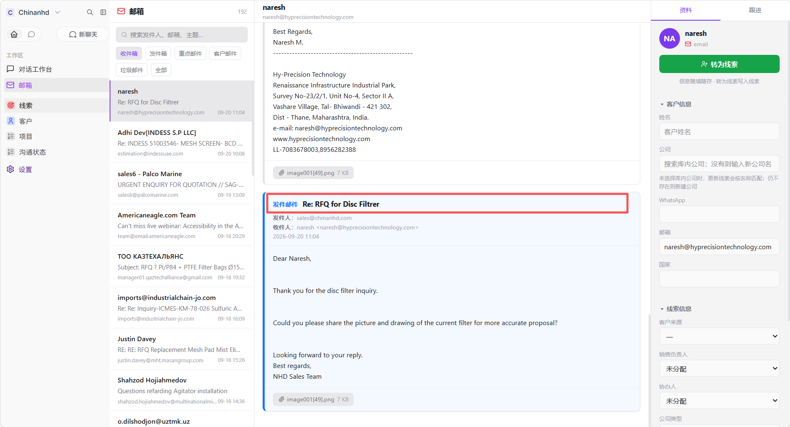

图：发件邮件的方向和本方回复内容。

### 重点、客户和垃圾邮件

- 邮件列表中的红旗/重点标识用于快速识别重点邮件；
- 网易邮箱的重点状态可以同步到 CRM，但同步需要等待后台同步周期；
- CRM 本地重点操作不一定会写回网易邮箱，实际以 CRM 当前状态为准；
- 标记为垃圾邮件后，应在垃圾邮件分类中查找，不应继续出现在收件箱分类中；
- 网易侧“客户”分类不一定对应统一的标准 IMAP 文件夹，因此不能保证所有网易客户标记都能自动同步。

### 从邮件创建线索

打开邮件后，在右侧资料表单填写客户姓名、公司、邮箱等信息，再转为线索。邮件中的收件人和抄送人可以作为候选信息来源；选择候选时只显示姓名，避免列表过于拥挤。

## 六、线索

### 这是做什么的

线索是仍需要确认、跟进或转化的潜在客户记录。官网表单、官网客服、WhatsApp 和邮件都可能产生线索。它处于业务漏斗的前段，重点是收集身份、需求和来源，判断是否值得继续跟进。

### 可以做什么

- 新建或修改线索；
- 填写线索名称、公司、联系人、邮箱、WhatsApp、国家、来源和客户需求；
- 指定销售负责人和协办人；
- 使用搜索、筛选、排序和保存视图；
- 将线索转为客户，或关联到已有客户；
- 记录产品需求、阶段和最新跟进。

### 重复提醒

保存或转化时，系统会检查 WhatsApp、手机号、邮箱和官网链接等标识。如果已有线索使用相同信息，会提示疑似重复。重复提醒只是风险提示，不会自动合并或删除记录；请先确认是否确实为同一客户。

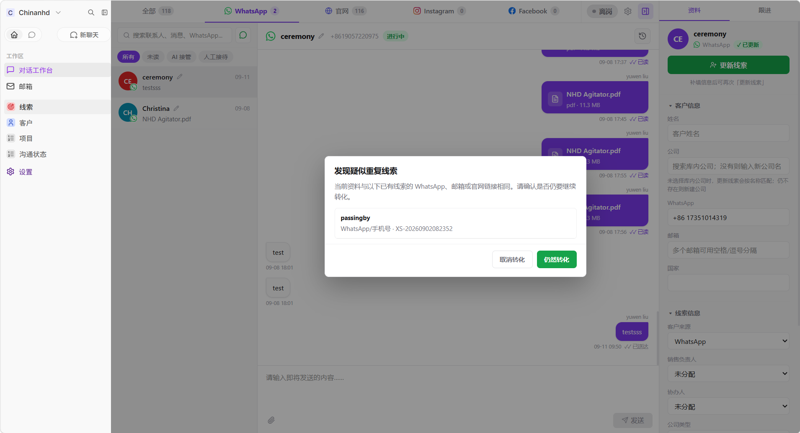

图：系统发现已有相同 WhatsApp、邮箱或官网链接时的提示。

### 负责人和协办人

- 未填写负责人和协办人的线索，默认对销售开放可见；
- 填写负责人后，销售通常只能看到自己负责或协办的记录；
- 主管和更高权限账号可查看更大范围的数据；
- 修改负责人或协办人会影响后续可见范围。
- 当前代码已实现：负责人本人或管理员可以设置协办人；“只有销售主管可以填写负责人”需要结合当前角色权限继续实测，暂不在手册中承诺为统一强制规则。

## 七、客户

客户是已经确认、需要长期维护的公司和联系人主数据，是较稳定的去重主数据。这里适合保存稳定的姓名、公司、邮箱、电话、WhatsApp、国家等资料。一个客户可以关联多个线索和项目；线索转为客户或关联已有客户，需要用户确认，不是所有记录都会自动搬迁。

可以在客户板块：

- 搜索和维护公司、联系人资料；
- 查看关联线索、项目和沟通记录；
- 补充跟进信息；
- 在新建前确认是否已有相同客户，减少重复建档。

## 八、项目

项目用于跟踪具体客户需求、订单或业务机会，是漏斗中进入实际业务推进后的管理维度。确认线索进入真实业务阶段后，可以建立项目，并关联客户、负责人、阶段和跟进信息。一个客户可以对应多个项目。

常见流程是：确认需求 → 建立项目 → 更新阶段 → 记录跟进 → 根据结果完成或继续推进。

## 九、沟通状态

沟通状态是沟通历史记录板块，不是即时聊天发送窗口，也不是新增数据的表单。新消息和新会话应在对话工作台中产生；这里用于按记录查看和复核已经发生的沟通。

可以在这里：

- 按负责人、协办人或状态查看记录；
- 查看完整消息、附件和回复成员；
- 按关键词查找历史对话；
- 复核客户、销售和 AI 的回复内容；
- 追踪沟通后是否形成线索或客户。

普通销售只能看到与自己相关的记录；自己是负责人或协办人时可以看到对应记录。管理员和销售主管可查看更大范围的历史沟通；老板角色按当前设计为只读。沟通状态中的普通销售不应通过这里新增或发送消息。

## 十、设置

设置板块用于维护个人资料、个人渠道和界面偏好。WhatsApp 绑定的完整步骤见上方“对话工作台”。

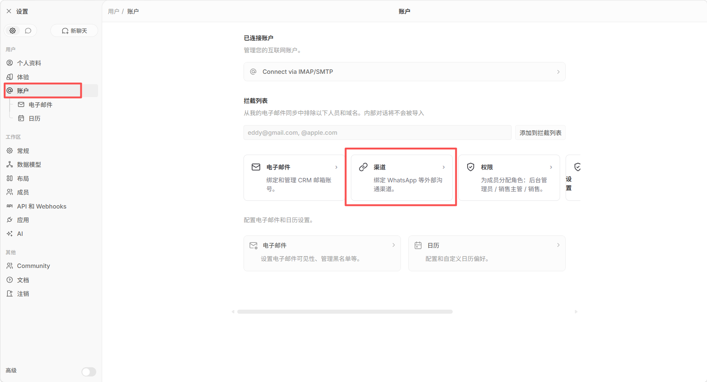

图：从设置的账户页面进入“渠道”。

## 十一、推荐工作流

### 官网访客

查看访客消息 → 必要时人工接管 → 补充右侧客户信息 → 转为线索 → 指定负责人 → 持续跟进。

### WhatsApp 客户

确认账号在线 → 回复客户 → 补充客户资料 → 转为线索或关联已有客户 → 继续跟进。

### 邮件客户

按收件/发件找到邮件 → 查看发件人、收件人、抄送人和引用历史 → 标记重点或客户邮件 → 在右侧补充资料 → 转为线索。

## 十二、常见问题

### 为什么看不到某条会话或线索？

先确认登录账号、角色、负责人和协办人。个人 WhatsApp 只属于绑定该账号的销售；线索和沟通状态还会受负责人、协办人和角色权限影响。

### 为什么刚收到的消息没有马上出现？

先刷新当前会话，再检查网络和渠道在线状态。系统使用实时通知并保留轮询兜底，网络中断、渠道掉线或源端延迟时，消息可能晚于实际到达时间。

### 为什么页面显示登录正常但没有数据？

登录态失效后，CRM 会停止显示旧数据并提示重新登录。刷新页面或重新登录后再操作，不要在失效页面重复提交。

### 为什么附件发送慢或失败？

大文件会受到浏览器、网络、服务器和 WhatsApp 源端处理速度影响。失败时先查看消息状态和错误提示，再重试；不要连续快速重复发送同一个大文件。

### 遇到权限、邮箱连接或 WhatsApp 异常怎么办？

先保留页面提示、发生时间和相关客户/会话名称，再联系系统维护人员处理。普通用户不要自行断开邮箱连接、修改系统配置或清理数据。

## 十三、手册维护规则

这份手册跟随 CRM 迭代维护。每次功能发布或界面调整后，至少同步检查以下内容：

- 功能板块是否新增、删除或改名；
- 操作步骤和按钮名称是否仍与页面一致；
- 相关截图是否需要重新截取，旧图是否会误导用户；
- 权限、通知、AI 规则和渠道状态说明是否发生变化；
- 网页版和 Markdown 版是否保持同一内容；
- 更新文档顶部的日期，并在发布前完成链接和图片检查。

小范围文字调整可以直接更新文档；涉及页面结构或操作流程的迭代，应同时更新对应截图。
